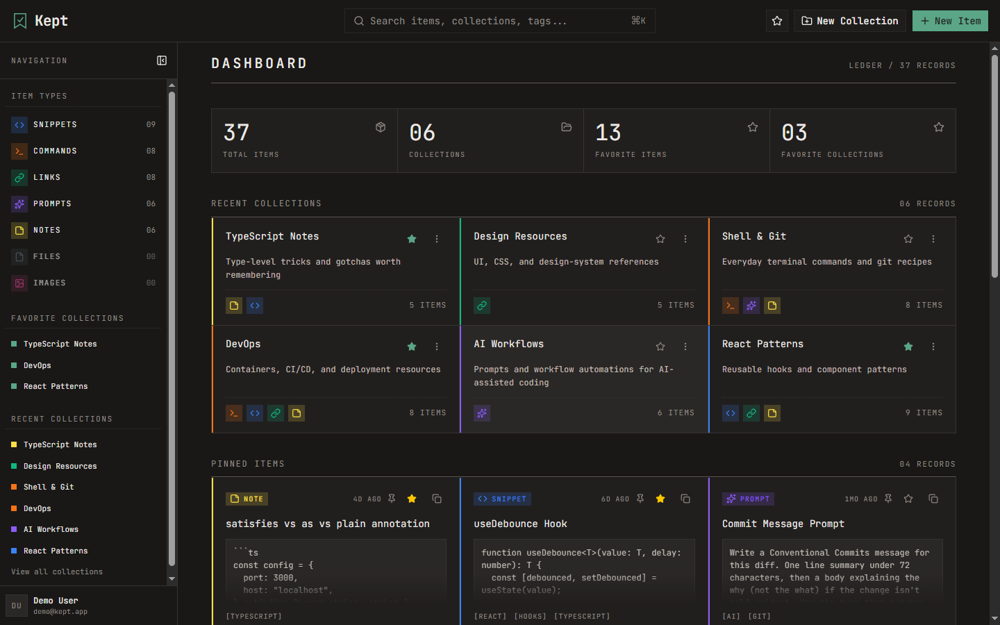
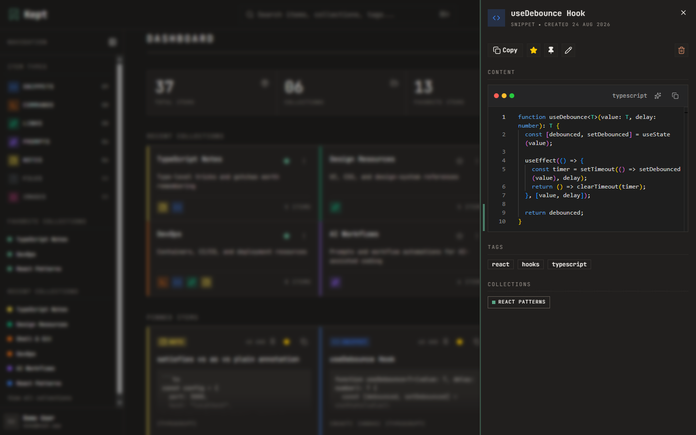
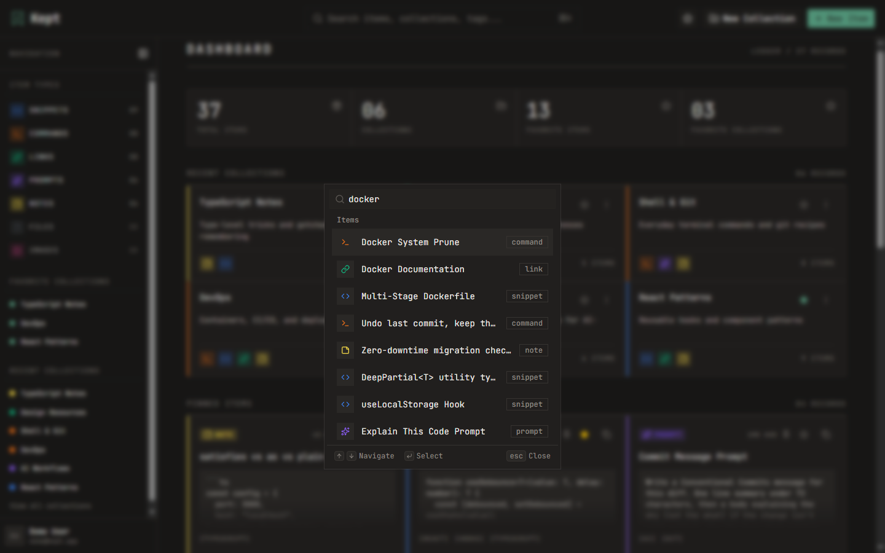
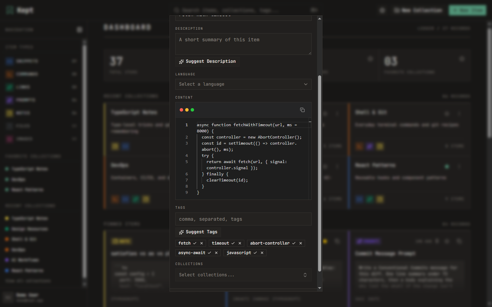

# Kept

**Keep Everything. Find Anything.**

A unified, searchable, AI-assisted hub for developer knowledge — snippets, prompts, commands,
notes, links, files, and images — with collections, a command palette, and a Stripe-gated Pro
tier.

[](https://github.com/john-pr/kept/actions/workflows/ci.yml)
&nbsp;[](LICENSE)
&nbsp;[**Live Demo →**](https://kept-app-ten.vercel.app/)

> _The CI badge goes green once the workflow from portfolio-prep 4 lands._

---

## Live demo

**https://kept-app-ten.vercel.app/**

| | |
|---|---|
| Demo email | _to be added_ |
| Demo password | _to be added_ |

Sign up with any email (verification is disabled on the demo) or use GitHub OAuth. The demo
database may be reset periodically.

---

## Screenshots

> Images live in [`docs/images/`](docs/images/) and are captured against the live demo.
> Placeholders until portfolio-prep 3's capture pass is run.

| Dashboard | Item drawer |
|---|---|
|  |  |

| Global search (⌘K) | AI auto-tagging |
|---|---|
|  |  |


---

## Features

**Items & types.** Seven built-in item types — Snippet, Prompt, Command, Note, Link (free) and
File, Image (Pro). All seven share one `Item` model; a type only decides which fields are
populated and how the value is rendered. Created and viewed in a fast side drawer that's
drag-resizable.

**Collections.** Group items of any type. Many-to-many — one item can live in several
collections, tracked through an explicit join table.

**Search / command palette.** ⌘K / Ctrl+K full-text search across titles, content, tags, and
types; pick an item to open its drawer, or a collection to navigate to it.

**AI (Pro).** Powered by OpenAI `gpt-5-nano` via the Responses API:

- Auto-tag suggestions
- Description generation
- "Explain this code" (in the Monaco editor)
- Prompt optimizer (in the Markdown editor)

**Auth.** Email/password (bcrypt) + GitHub OAuth via NextAuth v5. Email verification and
password reset use single-use, expiry-checked, 256-bit tokens. Sensitive endpoints are
rate-limited (Upstash sliding window, fails open when unconfigured).

**Billing.** Stripe Checkout + Customer Portal + a signature-verified webhook syncing `isPro`.
A canceled subscription keeps Pro until the period ends. A portfolio-only "demo Pro" bypass
toggles the flag directly for demoing without a real card.

**Free / Pro gating.** Free tier caps items and collections and locks the File/Image types and
all AI features. Enforcement sits behind the `PLAN_GATING_ENABLED` flag (**off by default** —
"full access until launch"); the gating _logic_ ships and is unit-tested regardless.

**i18n.** English, French, Polish via `next-intl` in cookie mode (no locale segment in the
URL). Preference persists on the user row and syncs across devices.

**Theming.** Dark (default) and light, via `next-themes`. Toggle in the user menu and the
marketing nav.

**Editors.** Monaco (`vs-dark`, per-user font/tab/theme/wrap/minimap preferences) for
snippet/command content; a Write/Preview Markdown editor for prompt/note content.

---

## Tech stack

| Layer | Choice |
|---|---|
| Framework | Next.js 16 (App Router, RSC) / React 19 |
| Language | TypeScript (strict, no `any`) |
| Database | Neon PostgreSQL |
| ORM | Prisma 7 (driver adapter) |
| Auth | NextAuth v5 (Credentials + GitHub OAuth) |
| Styling | Tailwind CSS v4 (CSS-based `@theme` config, no JS config) |
| Components | shadcn/ui on Base UI |
| File storage | Cloudflare R2 (S3-compatible) |
| Rate limiting | Upstash Redis |
| Payments | Stripe |
| AI | OpenAI `gpt-5-nano` (Responses API) |
| i18n | next-intl (cookie-based) |
| Email | Resend |
| Testing | Vitest (server actions + lib) · Playwright (E2E smoke) |
| Hosting | Vercel |

---

## Architecture

Reads are Server Components calling `src/lib/db/*` directly through Prisma, always scoped by
the session user id. Writes are Server Actions in `src/actions/*` that authenticate, validate
with Zod, check ownership, and return a `{ success, data?, error? }` result. API routes are
reserved for the cases that need them — NextAuth, the Stripe webhook, file upload/download,
and the single-item fetch the drawer makes on open. `src/proxy.ts` middleware is the fast
redirect gate; server-side checks are the real enforcement.

Full write-up, with an ER diagram and a request-flow diagram:
**[`docs/architecture.md`](docs/architecture.md)**.

---

## Getting started

**Prerequisites:** Node.js 20+, npm, and a PostgreSQL database (a free
[Neon](https://neon.tech) project works well).

```bash
git clone https://github.com/john-pr/kept.git
cd kept
npm install
cp .env.example .env      # then fill in the values below
npm run db:migrate        # apply Prisma migrations
npm run db:seed           # seed system item types + a demo user
npm run dev               # http://localhost:3000
```

Only `DATABASE_URL` and `AUTH_SECRET` are required to boot. Everything else degrades
gracefully — no OpenAI key just hides the AI buttons, no Upstash config means rate limiting
fails open, and so on.

### Environment variables

| Variable | Required | Description |
|---|---|---|
| `DATABASE_URL` | ✅ | Neon (or any) PostgreSQL connection string |
| `AUTH_SECRET` | ✅ | NextAuth JWT/session signing secret (`npx auth secret`) |
| `AUTH_GITHUB_ID` / `AUTH_GITHUB_SECRET` | — | GitHub OAuth app; email/password works without it |
| `RESEND_API_KEY` | — | Resend key for verification / password-reset email |
| `EMAIL_VERIFICATION_ENABLED` | — | `true` / `false` — gate sign-in on a verified email |
| `UPSTASH_REDIS_REST_URL` / `UPSTASH_REDIS_REST_TOKEN` | — | Upstash Redis for auth rate limiting (fails open if unset) |
| `R2_ACCOUNT_ID` / `R2_ACCESS_KEY_ID` / `R2_SECRET_ACCESS_KEY` / `R2_BUCKET_NAME` / `R2_PUBLIC_URL` | — | Cloudflare R2 for file & image uploads |
| `STRIPE_SECRET_KEY` / `STRIPE_PUBLISHABLE_KEY` / `STRIPE_WEBHOOK_SECRET` | — | Stripe billing |
| `STRIPE_PRICE_ID_MONTHLY` / `STRIPE_PRICE_ID_YEARLY` | — | Stripe recurring price IDs |
| `NEXT_PUBLIC_APP_URL` | — | App base URL for Stripe redirect URLs (default `http://localhost:3000`) |
| `PLAN_GATING_ENABLED` | — | `true` / `false` — enforce free-tier limits (default off) |
| `OPENAI_API_KEY` | — | OpenAI key for the AI features |

---

## Testing

```bash
npm run test         # Vitest — server actions (src/actions) + utilities (src/lib) only
npm run test:watch   # the same, in watch mode
npm run test:e2e     # Playwright smoke suite (tests/e2e)
npm run test:e2e:ui  # Playwright UI mode
```

By design there is **no component/DOM testing** — the unit suite covers server actions and
pure utilities, and a small Playwright smoke suite (`home`, `auth`, `items`, `search`) covers
the critical user paths end to end.

### Running the E2E suite

It runs against a **locally seeded dev database** and starts its own dev server:

```bash
npm run db:migrate && npm run db:seed
npm run test:e2e
```

Prerequisites (asserted in `tests/e2e/global-setup.ts`):

- **`EMAIL_VERIFICATION_ENABLED=false`** in `.env` — otherwise the register → sign-in flow is
  blocked by the verification interstitial.
- Leave **`UPSTASH_REDIS_REST_URL` / `UPSTASH_REDIS_REST_TOKEN` unset** for E2E — rate
  limiting fails open when unconfigured, so repeated runs don't trip the login/register
  limiters. `playwright.config.ts` blanks them for the server it starts; a dev server you
  started yourself keeps them active.

`auth`, `items`, and `search` each register a throwaway user (`e2e-smoke-…@example.test`).
These accumulate in the shared Neon `development` branch — run **`npm run db:cleanup`**
(`scripts/delete-non-demo-users.ts`) to remove every non-demo user.

---

## Project structure

```
src/
  actions/        Server Actions — items, collections, ai, billing, editor-preferences, i18n
  app/
    (app)/        authenticated route group — shared TopBar/Sidebar shell + loading.tsx
    api/          NextAuth, items/[id], upload, download/[id], stripe/*, webhooks/stripe
    page.tsx      marketing homepage
    sign-in, register, forgot-password, reset-password, check-email
  auth.ts, auth.config.ts, proxy.ts
  components/     dashboard/, items/, homepage/, settings/, ui/ (shadcn) …
  lib/
    db/           Prisma read functions (userId-scoped)
    *.ts          pure helpers — rate-limit, plan-limits, auth-guard, ownership, pagination …
  i18n/           next-intl request config
  messages/       en.json (source), fr.json, pl.json
  types/
prisma/           schema.prisma, migrations/, seed.ts
docs/             architecture.md, development-log.md, specs/, research/, audits/, images/
```

---

## How this was built

Kept was built **spec-first and AI-assisted**. Every feature and redesign pass started as a
short spec, was implemented on its own branch, tested, and logged.

- **[`docs/specs/`](docs/specs/)** — the ~30 feature specs, as written at the time, with an index.
- **[`docs/development-log.md`](docs/development-log.md)** — the chronological build log.
- **[`docs/audits/`](docs/audits/)** — a security-review pass over the auth code.
- **[`.claude/`](.claude/)** — the project's Claude Code setup: custom subagents
  (`code-scanner`, `refactor-scanner`, `auth-auditor`, `ui-reviewer`) and skills used
  throughout.

---

## License

[MIT](LICENSE)
