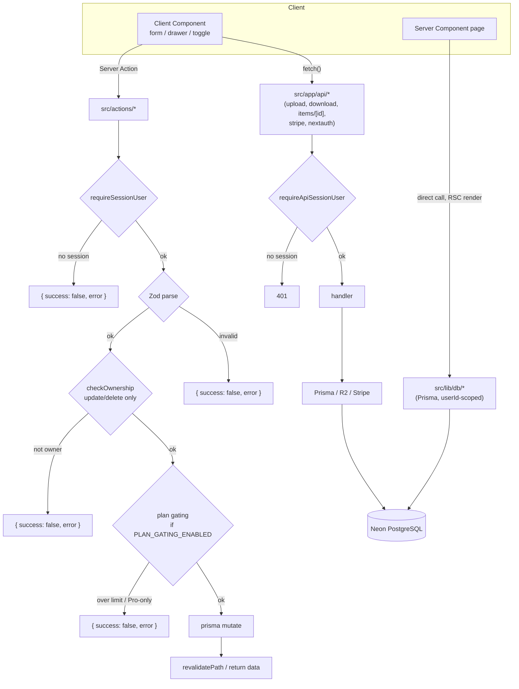

# Architecture

How Kept is put together: the data model, how a request flows through it, and the handful of
subsystems (auth, AI, uploads, plan gating, i18n) that carry most of the complexity.

Stack: Next.js 16 (App Router, React 19, RSC) · TypeScript (strict) · Prisma 7 → Neon
PostgreSQL · NextAuth v5 · Tailwind v4 + shadcn/ui · Cloudflare R2 · OpenAI · Stripe ·
Upstash Redis · next-intl.

---

## 1. Data model

Everything hangs off `User`. A user owns **items**, **collections**, and (for a future
custom-types feature) **item types**. An item has exactly one type and belongs to any number
of collections; tags are a global vocabulary shared across items.

```mermaid
erDiagram
    User ||--o{ Item : owns
    User ||--o{ Collection : owns
    User ||--o{ ItemType : "owns (custom, future)"
    User ||--o{ Account : "OAuth links"
    User ||--o{ Session : "(unused: JWT strategy)"

    ItemType ||--o{ Item : classifies
    Item ||--o{ ItemCollection : ""
    Collection ||--o{ ItemCollection : ""
    Item }o--o{ Tag : "ItemTags (implicit M:N)"

    User {
        string id PK
        string email UK
        string password "nullable — null for OAuth-only"
        datetime emailVerified "nullable"
        boolean isPro
        string stripeCustomerId UK "nullable"
        string stripeSubscriptionId UK "nullable"
        string stripeSubscriptionStatus "nullable"
        datetime stripeCurrentPeriodEnd "nullable"
        json editorPreferences "nullable"
        string locale "nullable — en|fr|pl"
    }
    ItemType {
        string id PK
        string name "Snippet|Prompt|Command|Note|Link|File|Image"
        string icon "lucide key, e.g. Code"
        string color "hex, e.g. #3b82f6"
        boolean isSystem
        string userId FK "null = system type"
    }
    Item {
        string id PK
        string title
        enum contentType "TEXT | FILE"
        string content "nullable — text body"
        string url "nullable — Link target"
        string fileUrl "nullable — R2 object"
        string fileName "nullable"
        int fileSize "nullable"
        string description "nullable"
        string language "nullable — Snippet syntax"
        boolean isFavorite
        boolean isPinned
        string userId FK
        string itemTypeId FK
    }
    Collection {
        string id PK
        string name
        string description "nullable"
        boolean isFavorite
        string defaultTypeId "nullable"
        string userId FK
    }
    ItemCollection {
        string itemId PK,FK
        string collectionId PK,FK
        datetime addedAt
    }
    Tag {
        string id PK
        string name UK
    }
```



### One `Item` model for seven types

The seven system types (Snippet, Prompt, Command, Note, Link, File, Image) are **`ItemType`
rows**, seeded by `prisma/seed.ts` with `isSystem: true` / `userId: null`. They are not an
enum and not a constants file — icon and color come from the DB row, resolved at render time
through `src/lib/icon-map.ts` (`"Code"` → the lucide component).

Nothing about persistence differs between types. Every `Item` has the same nullable columns
(`content`, `url`, `fileUrl`/`fileName`/`fileSize`, `language`, `description`); a type only
decides *which* are populated and *how* the value is shown. So the mutation and query layers
stay fully generic over `Item`, and only components branch on `itemType.name`:

| Concern | Type-specific? | Lives in |
|---|---|---|
| Which fields are required to save | yes (validation only) | Zod schemas in `src/actions/items.ts` |
| Persisting to the DB | no — one `prisma.item.create/update` for all | `src/actions/items.ts` |
| Icon / color | no — always from the `ItemType` row | `src/lib/icon-map.ts` |
| Form fields shown | yes | `ItemFormFields.tsx` |
| Detail / preview rendering | yes | drawer + card components |
| Pro-tier access (File/Image) | yes | `src/lib/plan-limits.ts` + call sites |

`contentType` is a coarse `TEXT | FILE` enum. Link items are stored as `TEXT` (they carry a
`url`, not a body) — "url" is a conceptual kind, not a DB value.

### Joins

- **Item ↔ Collection** — explicit `ItemCollection` join table so it can carry `addedAt`.
  Cascade-deletes from either side.
- **Item ↔ Tag** — Prisma implicit many-to-many (`ItemTags`). `Tag.name` is globally unique;
  tags are created on demand when an item references a new one.

### Migrations

Schema changes always go through `prisma migrate dev` (never `db push`). Migrations live in
`prisma/migrations/`; production runs `prisma migrate deploy` before the app starts.

---

## 2. Request flow

Two shapes cover almost everything:

- **Reads** — a Server Component calls a `src/lib/db/*` function directly (Prisma), scoped by
  the session user id. No API route.
- **Writes** — a Client Component calls a **Server Action** in `src/actions/*`, which
  authenticates, validates with Zod, checks ownership, mutates, and returns
  `{ success, data?, error? }`.

API routes (`src/app/api/*`) are reserved for the cases that genuinely need them: NextAuth
handlers, the Stripe webhook, file upload/download (streaming + progress), and
`GET /api/items/[id]` (the drawer fetches one item client-side on open).



`src/proxy.ts` (Next.js middleware) is the outer gate: it redirects unauthenticated requests
for `/dashboard`, `/profile`, `/items`, `/collections`, `/settings`, `/favorites` to
`/sign-in`. Server-side `auth()` / `requireSessionUser()` checks inside every page and action
are the real enforcement — the middleware is just the fast redirect.

Shared guard helpers keep the boilerplate down: `requireSessionUser()` /
`requireApiSessionUser()` (`src/lib/auth-guard.ts`), `checkOwnership()`
(`src/lib/ownership.ts`), `zodErrorResponse()` (`src/lib/api-response.ts`),
`enforceRateLimit()` (`src/lib/rate-limit.ts`), `ActionResult<T>`
(`src/types/action-result.ts`).

---

## 3. Auth (NextAuth v5)

**Split config.** `src/auth.config.ts` holds only what the edge middleware needs (providers
list shape, `pages`) so `src/proxy.ts` stays edge-safe. `src/auth.ts` is the full config —
`PrismaAdapter`, both providers, and the JWT/session callbacks — imported only in the Node
runtime.

**Session strategy is JWT**, not database sessions. The `jwt` callback re-reads `isPro` and
`locale` from the DB on every validation, so a plan change (Stripe webhook) or a language
change is reflected on the next request without waiting for token expiry. That's an accepted
per-request DB query, since middleware-protected routes validate the token on most requests.

**Providers.**

- **Credentials** — `authorize()` rate-limits by `ip:email` (5 per 15 min) via a
  `RateLimitedError`, looks the user up, `bcrypt.compare`s the password (returns `null` on any
  mismatch, never a distinguishing error), then — if `EMAIL_VERIFICATION_ENABLED` — blocks
  unverified users with an `EmailNotVerifiedError`.
- **GitHub OAuth** — standard. OAuth-only users have `password: null`; every password flow
  checks `hasPassword` first and refuses cleanly rather than comparing against null.

**Tokens.** Email-verification and password-reset both use the `VerificationToken` table.
Reset tokens are namespaced with a `reset:` identifier prefix so the two never collide. Both
are `crypto.randomBytes(32)` hex (256-bit), expiry-checked server-side (24h / 1h), single-use
(deleted on consumption and on expiry), and any prior token for an identifier is purged before
a new one is issued.

**Rate limiting.** `src/lib/rate-limit.ts` wraps Upstash Ratelimit (sliding window) and
**fails open** if Upstash env vars are absent — local dev isn't blocked, production enforces.
Applied to login, register, forgot-password, reset-password, resend-verification,
change-password, delete-account.

The `auth-auditor` subagent's review of this subsystem, with each finding's current status,
is in [`audits/AUTH_SECURITY_REVIEW.md`](audits/AUTH_SECURITY_REVIEW.md).

---

## 4. AI pipeline (Pro)

Four features — auto-tag, description, explain-code, optimize-prompt — share one shape:

```
src/lib/openai.ts            lazy OpenAI client + AI_MODEL = "gpt-5-nano"
   │
src/lib/{auto-tag,description,explain,optimize-prompt}.ts
   │   pure per-feature helpers: buildXInput() / parseXResponse()
   │   (no network, no auth — unit-tested in isolation)
   ▼
src/actions/ai.ts            one "use server" file, one action per feature
   │   requireSessionUser → isAiProGated → enforceRateLimit(20/hr per feature)
   │   → OpenAI Responses API call → parseXResponse → ActionResult<T>
   ▼
components  SuggestTagsButton / SuggestDescriptionButton / CodeEditor "Explain" /
            MarkdownEditor "Optimize"  — hidden entirely for free users
```

Notable decisions:

- **Responses API, not Chat Completions.** `gpt-5-nano` is a reasoning model and can return
  empty content when its token budget is spent; the Responses API is OpenAI's recommendation
  for reasoning models. See
  [`research/ai-auto-tag-gotchas-verification.md`](research/ai-auto-tag-gotchas-verification.md).
- **The "json" keyword gotcha.** The Responses API rejects JSON-object output mode unless the
  literal word "json" appears in the *input*, not just the instructions — auto-tag appends a
  line to the prompt to satisfy it. Description/explain/optimize request plain text and
  sidestep it.
- Actions take raw `title`/`content`, not an item id — the buttons are needed before an item
  exists.
- Each feature keeps its own rate-limit bucket.

---

## 5. File upload (Cloudflare R2)

R2 is S3-compatible; `src/lib/r2.ts` is a thin `@aws-sdk/client-s3` wrapper.
`src/lib/file-constraints.ts` holds the allowlist (SVG deliberately excluded — stored-XSS
vector) and size caps, as pure tested logic.

- `POST /api/upload` — an API route (not an action) because uploads need streaming and
  client-side progress. Auth-checked, constraint-checked, puts the object in R2, returns
  `{ fileUrl, fileName, fileSize }`.
- The `createItem` action just persists that reference — it never touches R2.
- `deleteItem` deletes the R2 object before the row (it needs the full item for the key,
  which is why it doesn't use the shared `checkOwnership` helper).
- `GET /api/download/[id]` — ownership-checked, streams the object back.

---

## 6. Plan gating (`src/lib/plan-limits.ts`)

Pure, tested predicates over `(count, isPro)`: `isOverItemLimit`, `isOverCollectionLimit`,
`isProOnlyType`. Free tier is `FREE_ITEM_LIMIT = 5`, `FREE_COLLECTION_LIMIT = 1`, and
File/Image types Pro-only (limits are set low deliberately so a portfolio visitor hits the
gate quickly).

Enforcement is behind `isPlanGatingEnabled()` (`PLAN_GATING_ENABLED === "true"`, **default
off** — the project's "full access until launch" policy). When on, `createItem` /
`createCollection` reject over-limit and Pro-only-type creates; the AI actions reject via
`isAiProGated()`.

`isPro` itself is synced from Stripe by `POST /api/webhooks/stripe` (signature-verified). A
canceled subscription keeps Pro until `stripeCurrentPeriodEnd` — `customer.subscription.deleted`
revokes, `.updated` does not. A portfolio-only `activateDemoPro` / `deactivateDemoPro` action
(`src/actions/billing.ts`) flips `User.isPro` directly for demoing, and refuses to touch users
with a real `stripeCustomerId`.

---

## 7. i18n (cookie-based next-intl)

next-intl in **cookie mode — no locale segment in the URL**, so every route, redirect, and
`proxy.ts` matcher was untouched by adding it.

- `src/i18n/request.ts` → `resolveLocale()`: cookie → `Accept-Language` → `en`.
- Root `layout.tsx` is async: sets `<html lang>`, wraps `NextIntlClientProvider`, localizes
  `generateMetadata`.
- Persistence: `User.locale` column; `setLocale` action writes cookie **and** DB;
  `session.user.locale` carries it; `LocaleSync` reconciles cookie against the saved account
  preference once per `(app)` mount.
- Messages: `src/messages/{en,fr,pl}.json` (~40 namespaces; `en` is the source of truth,
  `fr`/`pl` are machine drafts). `messages-parity.test.ts` asserts identical key sets.
- Deliberately left English: system `ItemType.name`s (they derive route slugs),
  server-action `error` strings, `file-constraints` messages, low-level `ui/*` internals,
  and transactional emails.

---

## 8. Where things live

```
src/
  actions/        Server Actions — items, collections, ai, billing, editor-preferences, i18n
  app/
    (app)/        authenticated route group — shared TopBar/Sidebar layout + loading.tsx
      dashboard, items/[type], collections, collections/[id], favorites, profile,
      settings, upgrade
    api/          NextAuth, items/[id], upload, download/[id], editor-preferences,
                  stripe/*, webhooks/stripe
    page.tsx      marketing homepage (redirects signed-in users to /dashboard)
    sign-in, register, forgot-password, reset-password, check-email
  auth.ts, auth.config.ts, proxy.ts
  components/     dashboard/, items/, homepage/, settings/, profile/, ui/ (shadcn)
  lib/
    db/           Prisma read functions (userId-scoped): items, collections, stats, users, session
    *.ts          pure helpers — rate-limit, plan-limits, auth-guard, ownership, color,
                  pagination, tags, format-date, r2, file-constraints, openai, …
  i18n/           next-intl request config
  messages/       en.json (source), fr.json, pl.json
  types/          shared types (ActionResult, next-auth module augmentation)
prisma/           schema.prisma, migrations/, seed.ts
```

Testing: Vitest, scoped to `src/actions/**` and `src/lib/**` only — server actions and pure
utilities. No component/DOM testing by design.
